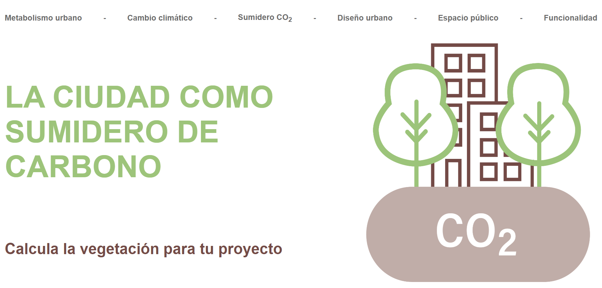
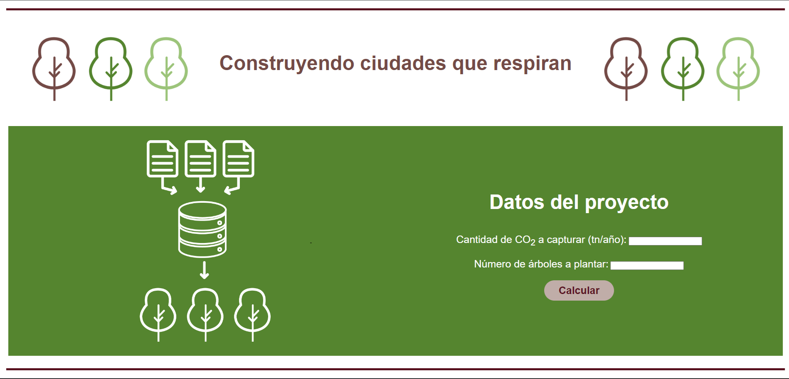
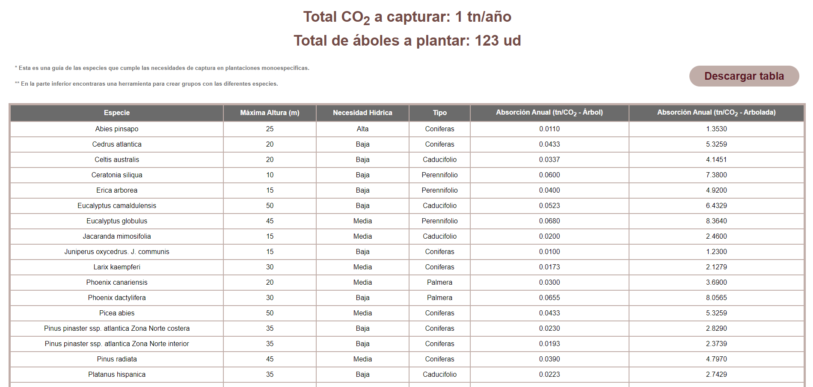
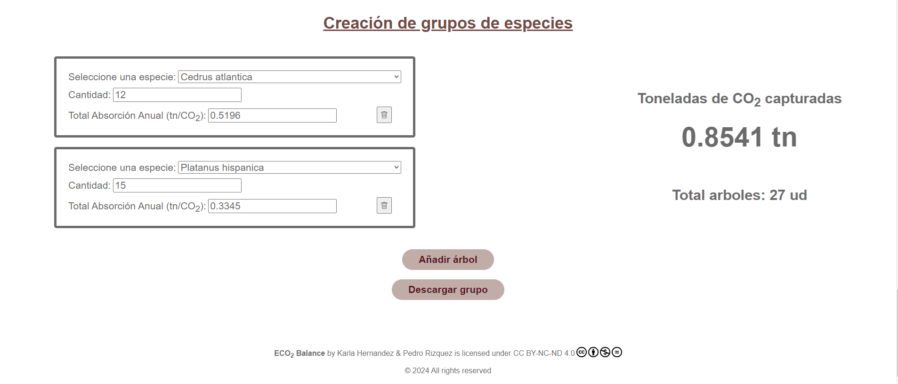

# La ciudad como sumidero de Carbono


## Descripcion del proyecto
Este proyecto desarrolla una interfaz de usuario que permite calcular las toneladas de CO<sub>2</sub> capturadas por las diferentes especies arbóreas para compensar la excesiva presencia de dicho gas en la atmosfera. La herramienta proporciona análisis detallados sobre cómo diferentes especies de plantas y árboles pueden ser utilizados para mitigar estas emisiones, contribuyendo así a la lucha contra el cambio climático y promoviendo la sostenibilidad urbana.

## Contexto
La mayor reserva de carbono biológicamente activo de los ecosistemas terrestres se encuentra en los primeros dos metros de suelo. En un contexto de cambio climático intensificado, es crucial entender y mitigar las emisiones de carbono en ambientes urbanos. El carbono orgánico del suelo juega un papel fundamental en la regulación del clima, el suministro de agua, y la biodiversidad, ofreciendo servicios esenciales para el bienestar humano.

## Funcionalidad
La interfaz permite a los usuarios:
- Indicar las toneladas de emisiones de CO<sub>2</sub> específicas de la zona, en conjunto con el total de unidades arbóreas a plantar.

- Recibir recomendaciones sobre los tipos de plantas necesarias para mitigar las emisiones de CO<sub>2</sub> indicadas.

- Realizar de forma manual, la creacion de grupos de especies para personalizar la solución a las emisiones de CO<sub>2</sub> indicadas.


> [!NOTE]
> Tanto las recomendaciones presentadas, como el grupo de especies creado se podran descargar como una tabla de `Excel` en formato `xlsx`.

## Tecnologia
Este proyecto esta construido con tecnologia de punta que asegura la eficacia, seguridad, eficiencia y una excelente experiencia de usuario. Algunas de las tecnologias utilizadas incluyen:
- Backend: Python
- Frontend: JavaScripts, HTML, CSS
- Base de datos: MySQL
- Infraestructura: Despliegue en Render y almancenamiento de la Base de Datos en Clever Cloud

## Estructura del proyecto
```
├── config
│   └── config.py
├── src
│   ├── models
│   │   └── trees.py
│   ├── routes
│   │   └── routes.py
│   ├── static
│   │   ├── images/...
│   │   ├── scripts/...
│   │   ├── styles/...
│   │   └── main.css
│   ├── templates
│   │   ├── index.html
│   │   └── page_error.html
│   └── utils
│       └── utils.py
├── .gitignore
├── LICENSE
├── main.py
├── README.md
└── requirements.txt
```
> [!NOTE]
> Todo el proyecto esta desarrollado en el Framework `Flask` de `Python`.

## Creacion del entorno de virtual
Se necesitara tener instalada previamente la libreria 'virtualenv', en caso contrario se podra instalar ejecutando el siguiente comando:
```
pip install virtualenv
```

Una vez instalada, para crear un entorno de desarrollo se debe ejecutar:
```
virtualenv venv
```
> [!TIP]
Se recomienda la creación de un entorno virtual para optimizar el desarrollo y la ejecución del proyecto.

## Dependencias
Comando para instalar las dependencias necesarias sobre este proyecto:
```
pip install -r requirements.txt
```

Comando para crear o actualizar el archivo txt que almacena las dependencias del proyecto:
```
pip freeze > requirements.txt  
```

## Contribuciones
Las contribuciones son bienvenidas. Si deseas contribuir al proyecto, por favor haz un `fork` del repositorio, crea una rama con tus mejoras y envía un `pull request`.

## Licencia
Este proyecto está bajo la Licencia `GPL-3.0`, lo que permite el uso, distribución y modificación del software bajo ciertas condiciones. Consulta el archivo LICENSE para más detalles.

<p xmlns:cc="http://creativecommons.org/ns#" xmlns:dct="http://purl.org/dc/terms/"><span>ECO<sub>2</sub> Balance</span> by <a rel="cc:attributionURL dct:creator" property="cc:attributionName" href="https://www.linkedin.com/in/karlam-hernandez/" target="_blank">Karla Hernandez</a> & <a rel="cc:attributionURL dct:creator" property="cc:attributionName" href="https://www.linkedin.com/in/pedro-rizquez/" target="_blank">Pedro Rizquez</a> is licensed under <a href="https://creativecommons.org/licenses/by-nc-nd/4.0/?ref=chooser-v1" target="_blank" rel="license noopener noreferrer" style="display:inline-block;">CC BY-NC-ND 4.0</a></p>
<p>© 2024 All rights reserved</p>